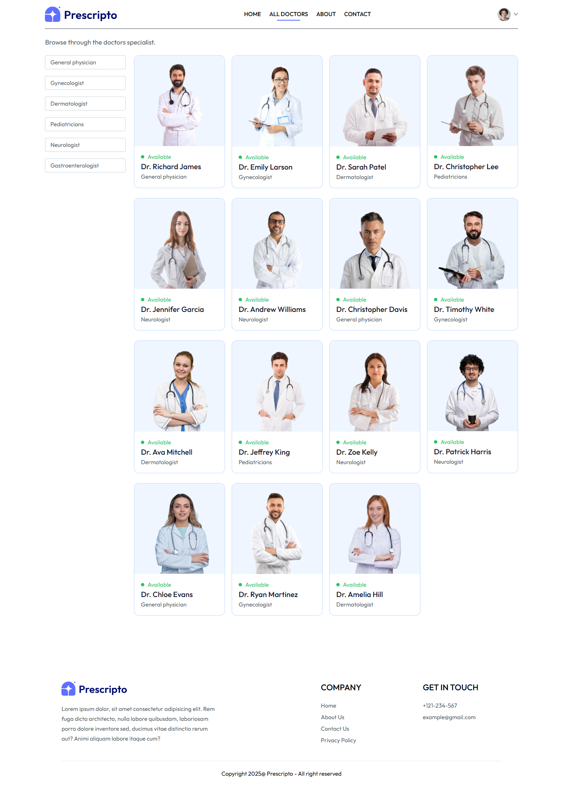
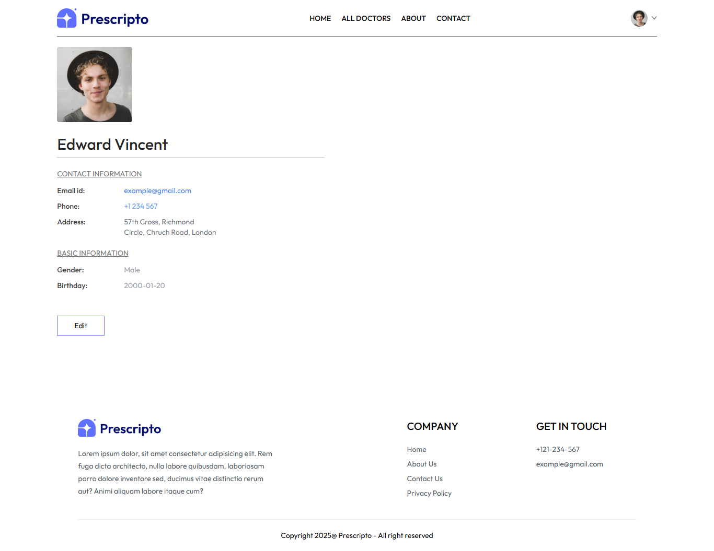
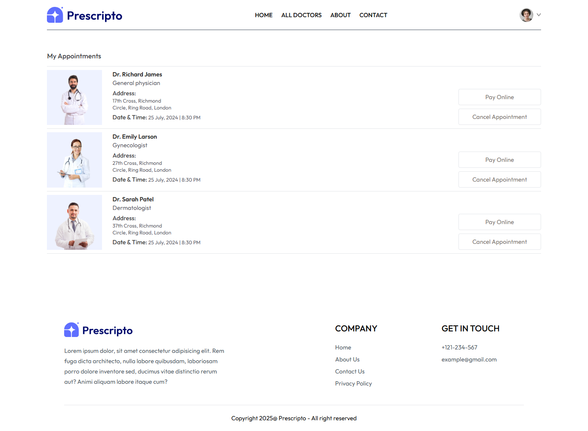

# 🩺 Prescripto – Doctor Appointment Frontend

Prescripto is a modern and user-friendly **doctor’s appointment booking website frontend** built using **React.js** and **Tailwind CSS**.  
This platform allows users to explore doctors, view detailed information, filter by specialties, and book appointments with ease.

---

## Features
-  Browse a list of famous doctors with detailed profiles.  
-  Book appointments by selecting available date and time.  
-  User profile management.  
-  Filter doctors based on specialty or criteria.  
-  Fully responsive and eye-soothing UI with Tailwind CSS.  

---

##  Tech Stack
-  **React.js** – Frontend library  
-  **Tailwind CSS** – Styling and responsive design  
-  **Vite** – Fast build tool  

---

## 📸 Screenshots  

| Home Page | All Doctor's Page |
|-----------|--------------|
|  |  |

| Doctor Details Page | User Profile  |
|--------------|------------|
|  |  |

### Appointment Booking Page  
  

---
git clone https://github.com/your-username/Prescripto-frontend.git
cd Prescripto-frontend
